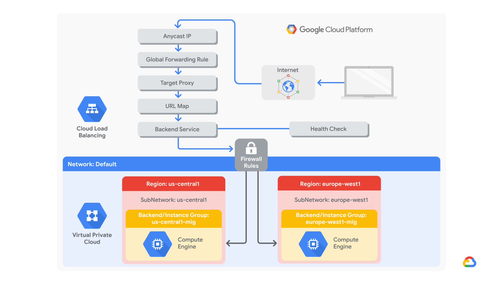

# Configuring an HTTP Load Balancer with Cloud Armor

- [Configuring an HTTP Load Balancer with Cloud Armor](#configuring-an-http-load-balancer-with-cloud-armor)
  - [Notes](#notes)
  - [Summary](#summary)
  - [Code Objectives](#code-objectives)
  - [Task 1 - Create a health check firewall rule](#task-1---create-a-health-check-firewall-rule)
  - [Task 2 - Create two NAT configurations using Cloud Router](#task-2---create-two-nat-configurations-using-cloud-router)
  - [Task 3 - Configuring an instance template and creating managed instance groups](#task-3---configuring-an-instance-template-and-creating-managed-instance-groups)
  - [Task 4 - Configuring the HTTP load balancer](#task-4---configuring-the-http-load-balancer)
  - [Task 5 - Test the HTTP load balancer](#task-5---test-the-http-load-balancer)
  - [Task 6 - Deny the **siege-vm**](#task-6---deny-the-siege-vm)

## Notes

* [ ] Revise Summary section
* [ ] Code to programmatically verify the backend. Try when running mock test

## Summary

Google Cloud HTTP(S) load balancing is implemented at the edge of Google's network in Google's points of presence (POP) around the world. User traffic directed to an HTTP(S) load balancer enters the POP closest to the user and is then load-balanced over Google's global network to the closest backend that has sufficient capacity available.

Cloud Armor IP deny/allow rules enable you to restrict or allow access to your HTTP(S) load balancer at the edge of the Google Cloud, as close as possible to the user and to malicious traffic. This prevents malicious users or traffic from consuming resources or entering your virtual private cloud (VPC) networks.

In this lab, you configure an HTTP load balancer with global backends, as shown in the diagram below. Then you stress test the load balancer and deny the stress test IP with Cloud Armor.

*Figure 1 - HTTP Load Balancer Cloud Architecture*


## Code Objectives

We will carry out the following tasks:

- Create a health check firewall rule
- Create two regional NAT configurations using Cloud Router
- Configure two instance templates
- Create two managed instance groups
- Configure an HTTP load balancer with IPv4 and IPv6
- Stress test an HTTP load balancer
- Deny an IP address to restrict access to an HTTP load balancer

## Task 1 - Create a health check firewall rule

We will create a firewall rule to allow health checks. Health checks are a fully managed service for automatically checking the health of cloud resources. In this case, we are going to use this to allow health-checking of our backend services. As we already know, firewall rules allow the connectivity to resources.

```bash
gcloud compute firewall-rules create fw-allow-health-checks \
--rules=tcp:80 \
--target-tags=allow-health-checks \
--action=ALLOW \
--source-ranges 130.211.0.0/22,35.191.0.0/16
```

## Task 2 - Create two NAT configurations using Cloud Router

Create two routers, one for US and Europe regions respectively, to router traffic to the backend services located the named region. This is done as our backend services do not have external IPs and thus cannot receive traffic directly.

Create the router and gateway for the US-based backend services

1. Create the router

    ```bash
    gcloud compute routers create nat-router-us-central1 \
    --region us-central1 \
    --network=default
    ```

1. Create the NAT gateway

    ```bash
    gcloud compute routers nats create nat-usa \
    --router nat-router-us-central1 \
    --router-region us-central1 \
    --auto-allocate-nat-external-ips \
    --nat-all-subnet-ip-ranges \
    --enable-logging
    ```

Create the router and gateway for the Europe-based backend services

1. Create the router

    ```bash
    gcloud compute routers create nat-router-europe-west1 \
    --region europe-west1 \
    --network=default
    ```

1. Create the NAT gateway

    ```bash
    gcloud compute routers nats create nat-europe \
    --router nat-router-europe-west1 \
    --router-region europe-west1 \
    --auto-allocate-nat-external-ips \
    --nat-all-subnet-ip-ranges \
    --enable-logging
    ```

## Task 3 - Configuring an instance template and creating managed instance groups

A managed instance group uses create instance templates to create a group of identical instances. In this case, we will use the instaance templates to specify the VM configuration of the backend compute engines.

1. Configure the instance template

    The instance template will define will the machine type, boot disk image, subnet, labels and other properties.

    ```bash
    gcloud compute instance-templates create us-central1-template \
    --network=default \
    --subnet=default \
    --region=us-central1 \
    --tags=allow-health-checks \
    --metadata startup-script-url=gs://cloud-training/gcpnet/httplb/startup.sh
    ```

    Creating another instance template for the europe-based backend services

    ```bash
    gcloud compute instance-templates create europe-west1-template \
    --network=default \
    --subnet=default \
    --region=europe-west1 \
    --tags=allow-health-checks \
    --metadata startup-script-url=gs://cloud-training/gcpnet/httplb/startup.sh
    ```

1. Create the managed instance groups

    ```bash
    gcloud compute instance-groups managed create us-central1-mig \
    --template=us-central1-template \
    --size=1 \
    --region=us-central1
    ```

    ```bash
    gcloud compute instance-groups managed set-autoscaling us-central1-mig \
    --max-num-replicas=5 \
    --cool-down-period=45 \
    --min-num-replicas=1 \
    --target-cpu-utilization=0.8 \
    --region=us-central1
    ```

    Create the europe managed instance groups

    ```bash
    gcloud compute instance-groups managed create europe-west1-mig \
    --template=europe-west1-template \
    --size=1 \
    --region=europe-west1
    ```

    ```bash
    gcloud compute instance-groups managed set-autoscaling europe-west1-mig \
    --max-num-replicas=5 \
    --min-num-replicas=1 \
    --cool-down-period=45 \
    --target-cpu-utilization=0.8 \
    --region=europe-west1
    ```

    It may be useful at this point to verify the backends (VM instances) are being created in both regions. Access to the HTTP sites will also be tested.

## Task 4 - Configuring the HTTP load balancer

1. Create the health checks

    ```bash
    gcloud compute health-checks create tcp http-health-check --port 80
    ```

1. Create the backend service

    ```bash
    gcloud compute backend-services create http-backend \
    --health-checks=http-health-check \
    --protocol=HTTP \
    --port-name=http \
    --global
    ```

1. Add the instance group backend services

    ```bash
    gcloud compute backend-services add-backend http-backend \
    --instance-group=us-central1-mig --instance-group-region=us-central1 \
    --balancing-mode=rate \
    --max-rate-per-instance=0.5 \
    --capacity-scaler=1.0 \
    --global
    ```

    ```bash
    gcloud compute backend-services add-backend http-backend \
    --instance-group=europe-west1-mig --instance-group-region=europe-west1 \
    --balancing-mode=utilization \
    --max-utilization=0.8 \
    --capacity-scaler=1.0 \
    --global
    ```

1. Create the url-map and the http proxy

    ```bash
    gcloud compute url-maps create http-lb \
    --default-service http-backend
    ```

    ```bash
    gcloud compute target-http-proxies create http-lb-proxy \
    --url-map http-lb
    ```

1. Create the forwarding rule for the frontend configuration

    ```bash
    gcloud compute forwarding-rules create http-lb-ipv4 \
    --ip-version=IPV4 \
    --target-http-proxy http-lb-proxy \
    --ports=80 \
    --global
    ```

    ```bash
    gcloud compute forwarding-rules http-lb-ipv6 \
    --ip-version=IPV6 \
    --target-http-proxy http-lb-proxy \
    --ports=80 \
    --global
    ```

## Task 5 - Test the HTTP load balancer

Test the capabilities of the load balancer by simulating a Denial of Service on the instance.

```bash
gcloud compute instances create siege-vm \
--zone=us-west1-c
```

Set the environment variable for *PROJECT_ID*

```bash
export PROJECT_ID=$(gcloud info --format='value(config.project)')
```

```bash
gcloud compute ssh --project $PROJECT_ID --zone=us-west1-c siege-vm
```

Leave the fields blank and press **Enter** through the series of prompts

Install the **siege** package to stress test the backend service

```bash
export LB_IP=<IPv4 address of the load balancer>
```

```bash
echo $LB_IP
```

```bash
siege -c 250 http://$LB_IP
```

Go to the cloud console's **Navigation Menu**, **Network Services** > **Load Balancing**. Click **Backends** > **http-backend**

Monitor the total inbound traffic between North America and the two backends for 2-3 minutes.

Go back to the **siege-vm** SSH session and stop the siege through `ctrl+c`

## Task 6 - Deny the **siege-vm**

Enable Cloud armor security policy

```bash
export SIEGE_IP=$(gcloud compute instances describe siege-vm --zone=us-west1-c \
--format='value(networkInterfaces.accessConfigs[0].natIP)')
```

```bash
gcloud compute security-policies create deny-siege

gcloud compute security-policies rules create 1000 \
--security-policy deny-siege \
--action=deny-403 \
--src-ip-ranges=$SIEGE_IP
```

```bash
gcloud compute backend-services update http-backend \
--security-policy deny-siege \
--global
```
