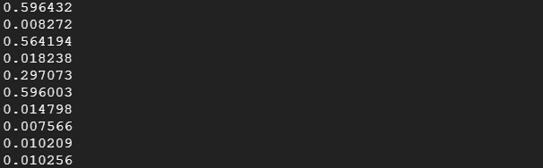

# Caching Cloud Storage Content with Cloud CDN

- [Caching Cloud Storage Content with Cloud CDN](#caching-cloud-storage-content-with-cloud-cdn)
  - [Overview](#overview)
  - [Task 1 - Create and populate a Cloud Storage bucket](#task-1---create-and-populate-a-cloud-storage-bucket)
  - [Task 2 - Create the HTTP load balancer with Cloud CDN](#task-2---create-the-http-load-balancer-with-cloud-cdn)
  - [Task 3 - Verify the caching of your bucket's content](#task-3---verify-the-caching-of-your-buckets-content)
    - [Invalidating the cache](#invalidating-the-cache)
  - [Review](#review)

## Overview

In this lab, you configure Cloud Content Delivery Network (Cloud CDN) for a Cloud Storage bucket and verify caching of an image. Cloud CDN uses Google's globally distributed edge points of presence to cache HTTP(S) load-balanced content close to your users. Caching content at the edges of Google's network provides faster delivery of content to your users while reducing serving costs.

In this lab, you learn how to perform the following tasks:

- Create and populate a Cloud Storage bucket
- Create an HTTP load balancer with Cloud CDN
- Verify the caching of your bucket's content
- Invalidate the cached content

## Task 1 - Create and populate a Cloud Storage bucket

The different types of backends that Cloud CDN can generate contnet for are below:
  
- Compute Engine virtual machine (VM) instance groups
- Zonal network endpoint groups (NEGs)
- Internet network endpoint groups (NEGs), for endpoints that are outside of Google Cloud (also known as custom origins)
- Google Cloud Storage buckets

export project id to use in creating a globally unqiue bucketname

```bash
export BUCKET_NAME=$(gcloud info --format='value(config.project)')
```

```bash
gsutil mb -l asia-east1 gs://$BUCKET_NAME
```

```bash
gsutil cp gs://cloud-training/gcpnet/cdn/cdn.png gs://$BUCKET_NAME
gsutil cp gs://cloud-training/gcpnet/cdn/regions.png gs://$BUCKET_NAME
```

```bash
 gsutil acl ch -u AllUsers:R gs://$BUCKET_NAME/cdn.png
 gsutil acl ch -u AllUsers:R gs://$BUCKET_NAME/regions.png
```

## Task 2 - Create the HTTP load balancer with Cloud CDN

To create a HTTP load balancer programmatically, we need to do the following

- Create the backend bucket
- Create the url map
- Create the http target proxy
- Create the forwarding rule for the frontend configuration

1. Create the backend bucket with cloud CDN enabled
  
      ```bash
      gcloud compute backend-buckets create cdn-bucket --gcs-bucket-name=$BUCKET_NAME \
      --enable-cdn
      ```

2. Create the URL map

    ```bash
    gcloud compute url-maps create cdn-lb \
    --default-backend-bucket cdn-bucket
    ```

3. Create the target HTTP proxy

    ```bash
    gcloud compute target-http-proxies create cdn-lb-proxy \
    --url-map cdn-lb
    ```

4. Create the forwarding rule

    ```bash
    gcloud compute forwarding-rules create http-lb-ipv4 \
    --ip-version=IPV4 \
    --target-http-proxy cdn-lb-proxy \
    --ports=80 \
    --global
    ```

## Task 3 - Verify the caching of your bucket's content

Get IP Address of Load Balancer and testing timing

```bash
export LB_IP_ADDRESS=$(gcloud compute forwarding-rules describe http-lb-ipv4 --global --format='value(IPAddress)')
```

```bash
for ((i=0;i<10;i++)); do curl -w  \
"%{time_total}\n" -o /dev/null -s http://$LB_IP_ADDRESS/cdn.png; done
```

The following output should be seen


### Invalidating the cache

When an object is cached, it normally remains in the cache until it expires or is evicted to make room for new content. Sometimes, you might want to remove an object from the cache before its normal expiration time. You can force an object, or set of objects, to be ignored by the cache by requesting a cache invalidation.

Open a new browser tab and navigate to http://[LB_IP_ADDRESS]/cdn.png, replacing [LB_IP_ADDRESS] with the IP address of the load balancer

Replacing the old image in the cloud storage bucket with a new one

```bash
gsutil cp gs://cloud-training/gcpnet/cdn/updatedcdn.png gs://$BUCKET_NAME/cdn.png
```

```bash
gsutil acl ch -u AllUsers:R gs://$BUCKET_NAME/cdn.png
```

```bash
gcloud compute url-maps invalidate-cdn-cache cdn-lb \
--path "/cdn.png"
```

This command takes a while to run as it propages globally to all regions

## Review

In this lab, you configured Cloud CDN for a backend bucket by configuring an HTTP load balancer and enabling Cloud CDN with a simple checkbox. You verified the caching of the bucket's content by measuring the time it takes to access the image. The first time you accessed the image, it took longer because the cache of the edge location did not contain the image yet. All other requests were quicker because the image was provided from the cache of the edge location closest to your Cloud Shell instance.

You then replaced the image and observed that the old image was still being cached. You resolved this by invalidating the cache through the Cloud Console.
