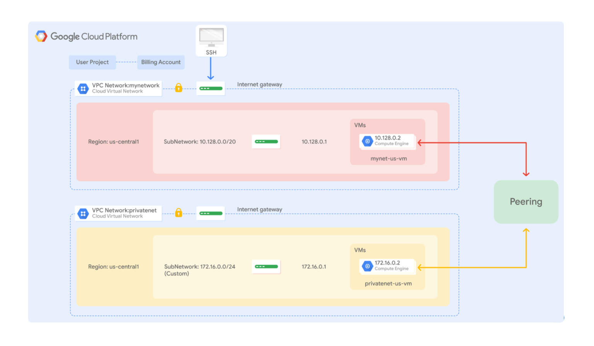

# Configuring VPC Network Peering

## Overview

In this lab, you configure VPC network peering between two networks. Then you verify private communication between two VMs in those networks, as illustrated in this diagram:



VPC network peering allows you to build SaaS (Software as a service) ecosystems in Google Cloud, which makes services available privately across different VPC networks within and across organizations. This allows workloads to communicate in private RFC 1918 space.

VPC network peering gives you several advantages over using external IP addresses or VPNs to connect networks, including:

Network Latency: Public IP networking results in higher latency than private networking.

Network Security: Service owners do not need to have their services exposed to the public internet and deal with its associated risks.

Network Cost: Google Cloud charges egress bandwidth pricing for networks using external IPs to communicate, even if the traffic is within the same zone. If, however, the networks are peered, they can use internal IPs to communicate and save on those egress costs. Regular network pricing still applies to all traffic.

In this lab, we perform the following tasks:

- Explore connectivity between non-peered VPC networks
- Configure VPC network peering
- Verify private communication between peered VPC networks
- Delete VPC network peering

Set the environment variable for *PROJECT_ID*

```bash
export PROJECT_ID=$(gcloud info --format='value(config.project)')
```

## Task 1 - Explore connectivity between non-peered VPC networks

//TODO Code section to test connectivity between non-peered VPC networks
Three networks have been created automatically for you in this lab. **mynetwork**, **privatenet** and **managementnet**, along with their respective firewall rules to allow ICMP, SSH, and RDP traffic. Additionally, four VM instances have been created **mynet-eu-vm**, **mynet-us-vm**, **privatenet-us-vm** and **managementnet-us-vm**.

Let's examine the created instances

```bash
gcloud compute instances list
```

Lets examine the VPC networks

```bash
gcloud compute networks list --sort-by=NETWORK
```

Also examine the firewalls created

```bash
gcloud compute firewall-rules list --sort-by=NETWORK
```

Next, we will SSH into an instance in one network and try to ping the internal and external IP addresses of an instance in another network to test connectivity.
We will use **privatenet-us-vm** and **mynet-us-vm** for this test.

Copy down the external IP address for **privatenet-us-vm**

```bash
gcloud compute instances describe privatenet-us-vm --zone=us-central1-a --format='value(networkInterfaces.accessConfigs[0].natIP)'
```

Copy down the internal IP address for **privatenet-us-vm**

```bash
gcloud compute instances describe privatenet-us-vm --zone=europe-west1-c --format='value(networkInterfaces.networkIP)'
```

```bash
gcloud compute ssh --project $PROJECT_ID --zone=us-central1-a mynet-us-vm
```

Follow and accept the series of prompts

Test the **privatenet-us-vm** internal IP address

```bash
ping -c 3 <privatenet internal ip address>
```

This does not work.

Test the **privatenet-us-vm** external IP address

```bash
ping -c 3 <privatenet external ip address>
```

This works as the firewall rule for the network accepts traffic from the internet.

Close the SSH terminal

```bash
exit
```

## Task 2 - Configure VPC network peering

```bash
gcloud compute networks peerings create peering-1-2 \
--network=mynetwork \
--peer-project=privatenet \
--auto-create-routes
```

```bash
gcloud compute networks peerings create peering-2-1 \
--network=privatenet \
--peer-project=mynetwork \
--auto-create-routes
```

## Task 3 - Verify private communication between peered VPC networks

Lets verify that routes have been established between **mynetwork** and **privatenet**.

Listing all the routes that should have been created after the peering connection

`gcloud compute routes list`

Ping from mynetwork to privatenet

```bash
gcloud compute ssh --project $PROJECT_ID --zone=us-central1-a mynet-us-vm
```

```bash
ping -c <privatenet-us-vm internal IP addres>
```

Unlike before the peering was established, this now works.

Pinging from privatenet to mynetwork will work as routes are established both ways.

Close the SSH termainl session

```bash
exit
```

## Task 4 - Delete VPC network peering

```bash
gcloud compute networks peerings delete peering 1-2
```

Show the state of the VPC peering. The peering listed should show up as INACTIVE in the state. This means that losing the peering on one network automatically disconnects the peering on the other network.

```bash
gcloud compute networks peerings list
```

## Summary

In this lab, VPC network peering is established between two networks, **mynetwork** and **privatenet**. Then we verified connectivity by pinging the VMs on their internal IP addresses within these networks.
